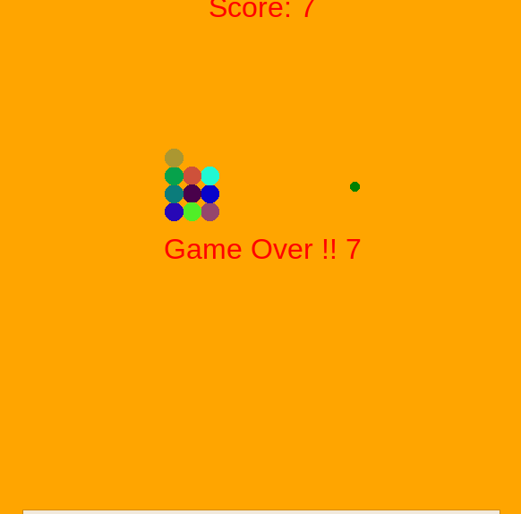

#  👨‍🎓 SNAKE TURTLE PYTHON 👩‍🎓
---

  🔎 **Ruta de investigación de Python y proyecto de Snake Game** 🔎 

---

Investigación y realización de proyecto para poder conocer tanto los conceptos básicos del lenguaje de Python como saber como aplicarlos en un proyecto.

Python
Marcos de competencias
Desarrollador web y web móvil

Contexto del proyecto
Contexto del proyecto
Python es nuestra próxima aventura en lenguaje para construir nuestro backend, pero "antes de caminar hay que aprender a gatear" por lo cual vamos a aprovechar la consulta teorica realizada sobre el lenguaje para aprender de manera práctica a traves de la realización de un juego clasico conocido como Snake Game. El cual se ralizará a traves de los siguientes momentos:

​

Crear el cuerpo de la serpiente
Animar el cuerpo de la serpiente
Controlar el movimiento de la serpiente
Crear la comida y su respectiva colisión
Crear el tablero de puntos
Detectar las colisiones con las cuatro paredes
Detectar la colisión con la cola o cualquier segmento del cuerpo de la serpiente
​

Tenga en cuenta que se aplicará Programación Orientada a Objetos (POO) pata tener una estructura de código más organizada.

Modalidades pedagógicas
Desarrollo individual del la ruta de trabajo establecida
Desarrollo de proyecto a traves de magistral con live coding
Criterios de rendimiento
Documentar adecuadamente la información recolectada durante su trabajo autónomo
Juego funcional
Buenas prácticas en la organización del repositorio
Modalidades de evaluación
Revisión del funcionamiento de correcto de la serpiente por parte del formador
Participación durante la master class (Con dudas u aportes)
Entregables
1.  Un documento de PDF en el cual este:
    - Las consultas realizadas sobre la ruta de aprendizaje de Python proporcionada
    - La retroalimentación de clase magistral en la cual se realizó el Snake Game 
2. El link al repo de Github el cual debe poseer:
    - El Snake Game funcional 
    - Su respectivo README bien organizado

---

---

**github**

- 👨‍💻 **[Dario Higuera Moreno]( https://github.com/dariohimo)**
  
---